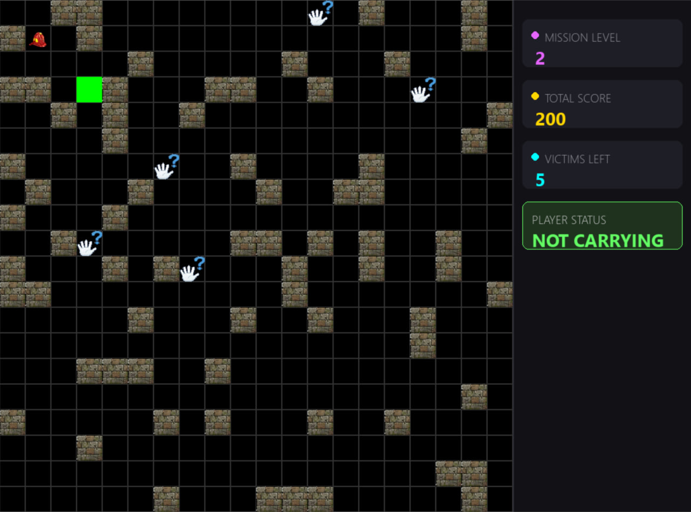
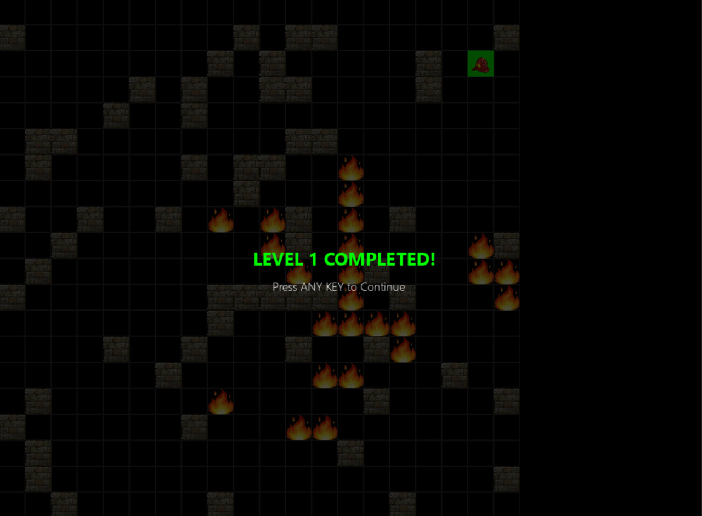
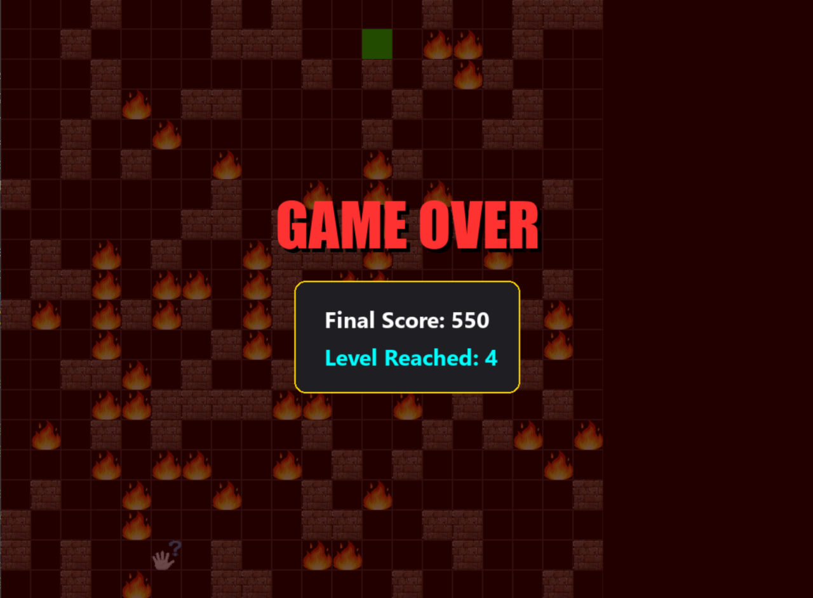

# 🔥 Blaze Runner

**Blaze Runner** is a grid-based strategy and rescue game built with Python and Pygame. You take on the role of a hero firefighter navigating a procedurally generated labyrinth to save victims. But beware—the fire isn't just an obstacle; it's alive. A dynamic **Adversary AI** tracks your movement and strategically ignites the path ahead to trap you.

---

## 📸 Screenshots

| Mission Overview | Level Up Screen | Game Over Stats |
| :---: | :---: | :---: |
|  |  |  |
| *Navigating the procedural maze* | *Level up screen* | *Gameover stats* |

## Key Features

* **Dynamic Adversary AI:** Every 3 steps, an AI calculates your route and sets fire to squares it predicts you will need.
* **Dual Pathfinding Engines:** * **BFS (Breadth-First Search):** Powers basic movement and "EASY" mode logic.
    * **Dijkstra’s Algorithm:** Used in "MEDIUM" mode, where the AI weights tiles near fire as high-cost to create smarter traps.
* **Procedural Level Generation:** No two games are the same. Walls, victims, and safe zones are randomly generated while ensuring a valid path always exists.
* **High-Stakes Scoring:** Stepping into fire costs 20 points, but the penalty doubles to **40 points** if you are carrying a victim.
* **Polished UI:** A dedicated sidebar tracks your mission level, total score, and current rescue status.

---

## How to Play

### Objectives
1.  **Locate Victims:** Find the victims scattered across the grid.
2.  **Rescue:** Walk over a victim to pick them up (you can carry one at a time).
3.  **Safe Zone:** Deliver the victim to the **Green Safe Zone** to earn 50 points.
4.  **Advance:** Clear all victims and return to the Safe Zone to reach the next level.

### Controls
* **Arrow Keys:** Move Up, Down, Left, or Right.
* **Any Key:** Continue after a level-up or restart after a "Game Over".

---

##  Technical Stack

* **Language:** Python 3.x
* **Library:** [Pygame](https://www.pygame.org/)
* **Algorithms:** BFS, Dijkstra's Algorithm, Procedural Generation.

---

## Project Structure

* `main.py`: The heart of the game. Manages the game loop, levels, and logic.
* `pathfinder.py`: Implements searching algorithms (BFS & Dijkstra).
* `adversary_ai.py`: The "enemy" logic that places fire strategically.
* `player.py`: Handles player movement, inventory, and health/score.
* `grid_map.py`: Manages the grid, wall density, and entity placement.
* `renderer.py`: Handles all visual elements, animations, and the sidebar.

---
**Created with ❤️ by Rahma Eldardery**
